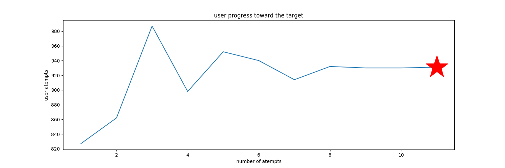

# Guess The Number Project




## Table of Contents 
- [Description](#description)
- [Technologies-Used](#Technologies-Used)
- [Installation](#installation)
- [Usage](#usage)
- [Features](#features)


## Description 
An implementation of the famous game Guess The Number. It made to show gradual increase in programming skills for educational and knowledge demonstration purpose.
The secret number and guessing are made by the machine using random library.
Database is created to collect all guesses trials 


## Technologies-Used
- Python
- matplotlib 
- SQLite 


## Installation
1. git clone https://github.com/aalmaamari/guess-the-number.git 
2. cd guess-the-number
3. cd guess-the-number-4.0.0 (or any ther version)
4. python3 -m venv .venv
5. source .venv/bin/activate
6. pip install -r requirements.txt


## Usage
Run the project:
``` bash
python guess-the-number.py
```


## Features
- simple code.
- matplotlib implemented.
- OOP implemented.
- The secret number and guessing are made by the machine.
- SQLite database to collect all guesses trials.